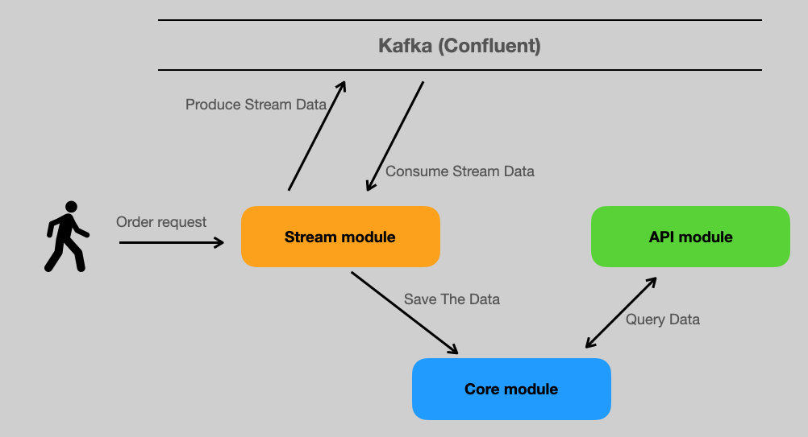
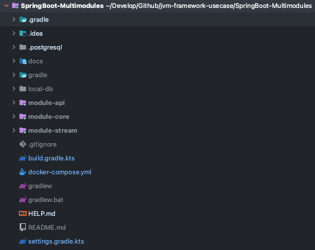

# 스프링부트 멀티모듈 구성하기

## 프로젝트 시작전

스프링부트를 사용해 프로젝트 sprint 1,2를 진행하면서 정말 기초적이지만 기본기능들을 만들게 되었다

진행하고 있는 이 프로젝트는, 한 개의 API서버, 한 개 이상의 Consumer Application, 차후에 생길 가능성이있는 배치서버 등으로 구성 될 수 있었다.

빠르게 진행되는 프로젝트라서, 백엔드 API 서버와 Stream 어플리케이션 서버를 각각 두었다.

기능들이 잘 동작하고, 스프린트 보고도 잘 끝났지만 소스코드를 놓고 보니 엔티티가 중첩되는 현상을 보았다.

멀티모듈을 적용시켜서 엔티티들을 공통적으로 사용하고, 그외의 고유한 기능들을 각각의 서버에서 사용하자는 생각이 들었다.

한번에 모든 세팅을 보기보다, 하나씩 사용해보고 기능을 확인하면서 전체적인 구조로 다가가려고한다.

보다보면 "왜저러지?" 라는게 있을 수 있는데... 글을 쓰면서도 고민이 많이되었기때문에 이해한다.

"각각 맞는 역할을 한다" 라기보다 모듈을 어떻게 설정했는지 보여주고싶었고, 차후에 개발을 할 때 고민해서 적용 해 보면 좋지 않을까? 한다.

## 프로젝트 구성하기

- 프로젝트 구조

    

  ```text
  - SpringBoot-Multimodules
    - module-api
    - module-core
    - module-stream
  ```
    - module-api
        - API 서버
        - API 호출로 현재 사용자를 생성하고 조회한다
        - API 호출로 들어온 order들을 Admin page에 제공하기위해 조회한다
    - module-core
        - API 서버에서 조회하기위한 Entity를 정의한다
        - Stream 서버에서 사용하기위한 Entity를 정의한다
    - module-stream
        - Stream 서버
        - Kafka를 사용해, API요청들을 order topic에 발송한다(Producer)
        - Stream에 발송된 order들을 받아서, DB에 저장한다(Consumer)

## 프로젝트 세팅하기

1. SpringBoot-Multimodules를 만든다.
    - SpringBoot-Multimodules는 Spring application으로 생성해도 되고, gradle project로 생성해도 된다.
      
    - 나는 SpringBoot로 생성했고, 기본적인 dependency들을 받았다.
       ```kotlin
          dependencies {
             // springboot
             implementation("org.springframework.boot:spring-boot-starter-web")
             implementation("org.springframework.boot:spring-boot-starter-data-jpa")
             implementation("com.fasterxml.jackson.module:jackson-module-kotlin")
             developmentOnly("org.springframework.boot:spring-boot-devtools")

             // kotlin
             implementation("org.jetbrains.kotlin:kotlin-reflect")
             implementation("org.jetbrains.kotlin:kotlin-stdlib-jdk8")

             // DB
             implementation("org.postgresql:postgresql:42.3.3")

             // test
             testImplementation("org.springframework.boot:spring-boot-starter-test")
          }
       ```
    - SpringBoot-Multimodules는 각각의 모듈들을 관리하는 프로젝트이기 때문에, dependency들은 각각의 모듈에서 관리한다.

2. gradle project를 생성한다.
    - 각각의 모듈들은 gradle project로 생성한다.
    - 나의경우, `module-api`, `module-core`, `module-stream` 을 생성했다.
    - 

3. 폴더를 정리 해 준다.
    - SpringBoot-Multimodules 가 root 프로젝트 이지만, 여기서 하는일은 주로 dependency 관리이기 때문에 src 하위 폴더를 모두 지워준다
    - SpringBoot-Multimodules 내에는 `module-api`, `module-core`, `module-stream` 과 gradle 폴더만 남는다.

4. Database를 로컬에 설치 해 준다. (나의경우 docker-compose로 postgresql을 올렸다)
    - docker-compose.yml을 root에 놓고 `docker-compose up -d` 명령어로 실행한다.
        ```yaml
        version: '3.9'

        services:
          postgres:
            image: postgres:14-alpine
            container_name: multimodule-postgres
            ports:
              - "9876:5432"
            volumes:
              - .postgresql/:/var/lib/postgresql/data
              - ./local-db/init_schema.sql:/docker-entrypoint-initdb.d/1-schema.sql

            environment:
              - POSTGRES_PASSWORD=password1234
              - POSTGRES_USER=wool
              - POSTGRES_DB=wooldb
        ```
    - local-db 폴더를 만들고, init_schema.sql을 작성한다.
      ```sql
      create schema springtest;
      ```
    - `docker-compose up -d` 명령어로 실행한다.

- 여기까지 하면, 아래의 그림처럼 폴더가 나온다
- 

## Gradle 작업하기

- 여러 프로젝트가 하나로 모였기 때문에 우리가 Build하는 시스템인 Gradle에게 알려주어야한다.

### Root Project (SpringBoot-Multimodule)에 Gradle 작업하기

- root project의 `settings.gradle.kts` 에 모듈을 알려준다
    ```kotlin
    // settings.gradle.kts
    rootProject.name = "SpringBoot-Multimodules"
    include("module-stream")
    include("module-api")
    include("module-core")
    ```

- root프로젝트에 작업이 완료되고나면, `build.gradle.kts` 를 수정해준다.
- 나의경우는 아래와 같은데, 소스를 참고해서 각 프로젝트별로 어떻게 다른지 확인해서 적용하면 될 것 같다.
    ```kotlin
    import org.jetbrains.kotlin.gradle.tasks.KotlinCompile
    import org.springframework.boot.gradle.tasks.bundling.BootJar

    plugins {
        id("org.springframework.boot") version "2.7.5"
        id("io.spring.dependency-management") version "1.0.15.RELEASE"
        kotlin("jvm") version "1.6.21"
        kotlin("plugin.spring") version "1.6.21" apply false
        kotlin("plugin.jpa") version "1.6.21" apply false
    }

    java.sourceCompatibility = JavaVersion.VERSION_17

    allprojects {
        group = "com.example"
        version = "0.0.1-SNAPSHOT"

        repositories {
            mavenCentral()
        }
    }

    subprojects {
        apply(plugin = "java")

        apply(plugin = "io.spring.dependency-management")
        apply(plugin = "org.springframework.boot")
        apply(plugin = "org.jetbrains.kotlin.plugin.spring")

        apply(plugin = "kotlin")
        apply(plugin = "kotlin-spring") //all-open
        apply(plugin = "kotlin-jpa")

        dependencies {
            // springboot
            implementation("org.springframework.boot:spring-boot-starter-web")
            implementation("org.springframework.boot:spring-boot-starter-data-jpa")
            implementation("com.fasterxml.jackson.module:jackson-module-kotlin")
            developmentOnly("org.springframework.boot:spring-boot-devtools")

            // kotlin
            implementation("org.jetbrains.kotlin:kotlin-reflect")
            implementation("org.jetbrains.kotlin:kotlin-stdlib-jdk8")

            // DB
            implementation("org.postgresql:postgresql:42.3.3")

            // test
            testImplementation("org.springframework.boot:spring-boot-starter-test")
        }

        dependencyManagement {
            imports {
                mavenBom(org.springframework.boot.gradle.plugin.SpringBootPlugin.BOM_COORDINATES)
            }

            dependencies {
                dependency("net.logstash.logback:logstash-logback-encoder:6.6")
            }
        }

        tasks.withType<KotlinCompile> {
            kotlinOptions {
                freeCompilerArgs = listOf("-Xjsr305=strict")
                jvmTarget = "17"
            }
        }

        tasks.withType<Test> {
            useJUnitPlatform()
        }

        configurations {
            compileOnly {
                extendsFrom(configurations.annotationProcessor.get())
            }
        }
    }

    // module core 에 module api, consumer이 의존
    project(":module-api") {
        dependencies {
            implementation(project(":module-core"))
        }
    }

    project(":module-stream") {
        dependencies {
            implementation(project(":module-core"))
        }
    }

    // core 설정
    project(":module-core") {
        val jar: Jar by tasks
        val bootJar: BootJar by tasks

        bootJar.enabled = false
        jar.enabled = true

    }
    ```

### module-core에 Gradle 작업하기

- module-core의 `build.gradle.kts` 를 아래와 같이 수정한다
    ```kotlin
    plugins{

    }

    allOpen {
        annotation("javax.persistence.Entity")
        annotation("javax.persistence.Embeddable")
        annotation("javax.persistence.MappedSuperclass")
    }

    noArg {
        annotation("javax.persistence.Entity") // @Entity가 붙은 클래스에 한해서만 no arg 플러그인을 적용
        annotation("javax.persistence.Embeddable")
        annotation("javax.persistence.MappedSuperclass")
    }

    dependencies{

    }

    ```

### module-api에 Gradle 작업하기
- module-api에 `build.gradle.kts` 를 아래와 같이 수정한다
    ```kotlin
    plugins{

    }

    dependencies{

    }

    ```

### module-stream에 Gradle 작업하기
- module-stream에 `build.gradle.kts` 를 아래와 같이 수정한다
    ```kotlin
    plugins{

    }

    dependencies{
        implementation("org.springframework.kafka:spring-kafka")
        implementation("org.springframework.boot:spring-boot-starter-data-jpa")
    }

    ```

## 세팅을 마치며
- 세팅 하는데 꽤 오래걸린 것 같다. 이것저것 삽질도 많이 했다.
- 중요한 포인트는, 패키지들을 만들고 모듈을 만들 때 "패키지 구조"를 같게 해 주어야 한다.
  - 예를 들어, `com.wool`로 패키지를 만들었다면 다른 모듈에서도 동일하게 `com.wool`로 생성 해 주어야 한다.

## 참고
- [우아한 형제들 테크블로그](https://techblog.woowahan.com/2637/)
