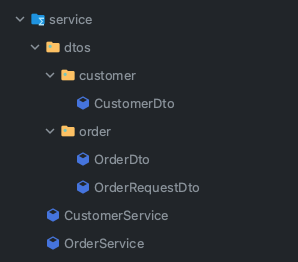
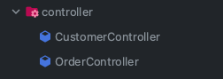

# API Module 만들기

- `module-api`에서 `module-core`를 잘 호출하는지 확인 할 수 있는 간단한 API를 만들어보자
- `module-core`에서 `Customer`와 `Order` 엔티티를 선언했는데, 이에 맞게 `module-api`에서는 `Customer`와 `Order` 읽어오기 / 쓰기 API를 만들어 보자.
- 전체 적인 구조를 보았을 때, 나중에 가서는 역할이 달라 질 수 있겠지만(활용하기 나름...) `Customer`와 `Order`를 간단히 사용 해 보자

## API Module 만들기 1 - 의존성 추가

- 나의 `module-api`의 `build.gradle.kts`에는 아래와 같이 비어있다.
    ```kotlin
    plugins{

    }

    dependencies{

    }
    ```
- `module-api`에서 혹시 다른 디펜던시를 사용하고싶다면, `build.gradle.kts`의  `dependencies`에 추가 해 주자

## API Module 만둘기 2 - 패키지 세팅하기

- `module-core`에서 말했듯이, 멀티모듈을 사용하려면 base package 이름이 같아야한다.
- `com.wool` 패키지를 생성하고, 하위에 사용 할 패키지들을 따로 생성 해 주자
    - (패키지는 아니지만...) `ModuleApiApplication.kt` 를 생성하고 스프링 부트 어플리케이션을 선언 해 주자
      ```kotlin
      package com.wool

      import org.springframework.boot.autoconfigure.SpringBootApplication
      import org.springframework.boot.runApplication

      @SpringBootApplication
      class ModuleApiApplication

      fun main(args: Array<String>) {
          runApplication<ModuleApiApplication>(*args)
      }
      ```
    - `com.wool.controller` : API Controller, 외부 Request를 받아 Response 해주는 역할
    - `com.wool.repository` : API에서 사용 할 Repository, `module-core`에서 선언한 엔티티를 불러와서 Repository에서 사용
    - `com.wool.service` : API에서 사용 할 Service, `repository`에서 불러온 데이터를 가공하여 `controller`에게 전달
- 이 외에도 각각의 dto들이 있을 수 있다. 이건, 생성하면서 같이 보기로 하자.

## API Module 만들기 3 - Repository 만들기

- `com.wool.repository` 패키지를 생성하고, `ModuleCoreCustomerRepository.kt`와 `ModuleCoreOrderRepository.kt`를 생성하자
- 나는 `module-core`에서 엔티티가 왔다는 것을 기억하고싶어서, 레포지토리 이름 앞에 `ModuleCore`를 붙여주었다.
- 신기한점은, `module-core`에서 선언한 엔티티를 `module-api`에서 사용 할 수 있다는 것이다.
- `module-core` 라는 모듈명이 붙지 않아도, 그대로 사용이 가능하다.
- 

### Repository 만들기 1 - ModuleCoreCustomerRepository.kt

- JPA를 사용하기 위해 `JpaRepository`를 상속받는다.
  ```kotlin
  // com.wool.repository.ModuleCoreCustomerRepository.kt
  package com.wool.repository

  import com.wool.entity.Customer
  import org.springframework.data.jpa.repository.JpaRepository

  interface ModuleCoreCustomerRepository : JpaRepository<Customer, Long> {

  }
  ```

### Repository 만들기 2 - ModuleCoreOrderRepository.kt

- 마찬가지로 JPA를 사용하기때문에 `JPARepository`를 상속받는다.
  ```kotlin
  package com.wool.repository

  import com.wool.entity.Customer
  import org.springframework.data.jpa.repository.JpaRepository

  interface ModuleCoreCustomerRepository:JpaRepository<Customer, Long> {

  }
  ```

## API Module 만들기 4 - Service 만들기

- 이제 방금 만든 `Repository`를 주입해서 사용 할 `Service`를 만들어보자
- `service` 패키지에는, `Controller`에서 들어온 데이터를 가지고 `Repository`와 소통 해 주어야 하기 때문에 `dto`를 만들어준다
- `customer`는 `CustomerDto`를, `order`는 `OrderDto` 와 `OrderRequestDto` 를 만들어준다
    - `OrderRequestDto` : 컨트롤러에서 받아주는 데이터 형태. `OrderDto`에 매핑되어있는 `Customer` 작업을 위해 `customer_id`를 만들어 준다
    - `OrderDto` : `OrderRequestDto` 에서 받아온 customer 데이터를 가지고, `Customer`를 찾아서 `Order`에 매핑해주는 역할을 한다
- 

### Service Dto 만들기 1 - CustomerDto.kt

- Customer 데이터를 엔티티로 만들어주는 역할을 하는 data클래스이다
  ```kotlin
  package com.wool.service.dtos.customer

  import com.wool.entity.Customer

  data class CustomerDto(
      val customerNickName: String,
      val customerAddress: String,
  ) {
      fun toEntity() =
          Customer(
              customerNickName = this.customerNickName,
              customerAddress = this.customerAddress
          )
  }
  ```
    - `toEntity()` : `CustomerDto`를 `Customer` 엔티티로 만들어주는 역할을 한다

### Service Dto 만들기 2 - OrderRequestDto.kt

- Controller에서 데이터를 받아오는 `OrderRequestDto.kt` 를 만들어준다
  ```kotlin
  package com.wool.service.dtos.order

  data class OrderRequestDto(
      val orderStoreName: String,
      val orderStoreAddress: String,
      val orderItem: String,
      val orderPrice: Int,
      val customerId: Long,
  )
  ```
    - `customerId` : `OrderRequestDto`에서 추출해 `CustomerRepository`를 통해 `Customer`를 찾기 위한 값

### Service Dto 만들기 3 - OrderDto.kt

- `OrderRequestDto`를 통해 `Customer` 객체를 받아 온 후에 `OrderDto`에 매핑되어 값을 받아오도록 하는 data클래스
  ```kotlin
  package com.wool.service.dtos.order

  import com.wool.entity.Customer
  import com.wool.entity.Order

  data class OrderDto(
      val orderStoreName: String,
      val orderStoreAddress: String,
      val orderItem: String,
      val orderPrice: Int,
      val customer: Customer,
  ){
      fun toEntity() = Order(
          orderStoreName = this.orderStoreName,
          orderStoreAddress = this.orderStoreAddress,
          orderItem = this.orderItem,
          orderPrice = this.orderPrice,
          customer = this.customer
      )
  }
  ```

### Service 만들기 1 - CustomerService.kt

- `CusomterDto`와 함께 `ModuleCoreCustomerRepository`에서 통신한 데이터를 조합하고 Controller로 넘겨주는 역할
  ```kotlin
  package com.wool.service

  import com.wool.repository.ModuleCoreCustomerRepository
  import com.wool.service.dtos.customer.CustomerDto
  import org.springframework.stereotype.Service

  @Service
  class CustomerService(
      private val customerRepository: ModuleCoreCustomerRepository
  ) {

      fun getCustomers() = customerRepository.findAll()

      fun saveCustomers(customerDto: CustomerDto) {
          this.customerRepository.save(customerDto.toEntity())
      }
  }
  ```
    - `getCustomers()` : `ModuleCoreCustomerRepository`에서 `findAll()`을 통해 모든 `Customer`를 가져온다
    - `saveCustomers()` : `CustomerDto`를 `Customer` 엔티티로 만들어 `ModuleCoreCustomerRepository`에 저장한다

### Service 만들기 2 - OrderService.kt

- `Controller`에서 받아온 `OrderRequestDto`를 통해 `Customer`를 찾아 `OrderDto`에 매핑하여 값을 불러오고 저장하는 역할
  ```kotlin
  package com.wool.service

  import com.wool.entity.Customer
  import com.wool.repository.ModuleCoreCustomerRepository
  import com.wool.repository.ModuleCoreOrderRepository
  import com.wool.service.dtos.order.OrderRequestDto
  import com.wool.service.dtos.order.OrderDto
  import org.springframework.stereotype.Service


  @Service
  class OrderService(
      private val orderRepository: ModuleCoreOrderRepository,
      private val customerRepository: ModuleCoreCustomerRepository
  ) {

      fun getOrders() = orderRepository.findAll()

      fun saveOrder(orderRequestDto: OrderRequestDto) {
          val customer: Customer = customerRepository.findById(orderRequestDto.customerId).get()
          //customer가 있을 경우
          if (customer != null) {
              val orderDto = OrderDto(
                  orderStoreName = orderRequestDto.orderStoreName,
                  orderStoreAddress = orderRequestDto.orderStoreAddress,
                  orderItem = orderRequestDto.orderItem,
                  orderPrice = orderRequestDto.orderPrice,
                  customer = customer
              )
              orderRepository.save(orderDto.toEntity())
          } else {
              //customer가 없을 경우
              throw Exception("customer가 없습니다.")
          }

      }

  }
  ```
    - `getOrders()` : `ModuleCoreOrderRepository`에서 `findAll()`을 통해 모든 `Order`를 가져온다
    - `saveOrder()` : `OrderRequestDto`를 통해 `Customer`를 찾아 `OrderDto`에 매핑하여 값을 불러오고 저장한다

## API Module 만들기 5 - Controller

- 외부의 요청을 받아 줄 수 있는 `Controller`를 만든다
- 자세하게 만든 기능이 아니기 때문에, 컨트롤러는 Dto 설정 외에 크게 볼 것이 없는 것 같다
- 

### Controller 만들기 1 - CustomerController.kt

```kotlin
package com.wool.controller

import com.wool.service.CustomerService
import com.wool.service.OrderService
import com.wool.service.dtos.customer.CustomerDto
import org.springframework.web.bind.annotation.GetMapping
import org.springframework.web.bind.annotation.PostMapping
import org.springframework.web.bind.annotation.RequestBody
import org.springframework.web.bind.annotation.RestController


@RestController
class CustomerController(
    private val customerService: CustomerService
) {

    @PostMapping("/customers")
    fun saveCustomers(@RequestBody customerDto: CustomerDto) {
        return this.customerService.saveCustomers(customerDto)
    }

    @GetMapping("/customers")
    fun getCustomers() = this.customerService.getCustomers()
}
```

- `saveCustomers()` : `CustomerDto`를 `CustomerService`에 넘겨주어 저장한다
- `getCustomers()` : `CustomerService`에서 `Customer`를 가져와 반환한다

### Controller 만들기 2 - OrderController.kt

```kotlin
package com.wool.controller

import com.wool.service.OrderService
import com.wool.service.dtos.order.OrderRequestDto
import org.springframework.web.bind.annotation.GetMapping
import org.springframework.web.bind.annotation.PostMapping
import org.springframework.web.bind.annotation.RequestBody
import org.springframework.web.bind.annotation.RestController


@RestController
class OrderController(
    private val orderService: OrderService
) {

    @GetMapping("/orders")
    fun getOrders() = orderService.getOrders()

    @PostMapping("/orders")
    fun saveOrders(@RequestBody orderRequestDto: OrderRequestDto) {
        //save order
        return orderService.saveOrder(orderRequestDto)
    }
}
```

- `getOrders()` : `OrderService`에서 `Order`를 가져와 반환한다
- `saveOrders()` : `OrderRequestDto`를 `OrderService`에 넘겨주어 저장한다

## API Module 설정추가 - application.yml

- 서버를 동작시키는 여러 설정값들은 `application.yml` 에서 관리하자
- `application.yml`에 적은 값은, docker-compose로 실행한 postgresql 정보를 가져와 작성했다
- `resources` 패키지 아래에 `application.yml`을 만들고 아래와 같이 적는다
    ```yaml
    spring:
      datasource:
        hikari:
          pool-name: HikariCp
          maximum-pool-size: 2
          minimum-idle: 2
        username: wool
        password: password1234
        url: jdbc:postgresql://localhost:9876/wooldb
        driver-class-name: org.postgresql.Driver
      jpa:
        hibernate:
          ddl-auto: update
        show-sql: true
        properties:
          hibernate:
            format_sql: true
            default_schema: springtest
      jackson:
        serialization:
          fail-on-empty-beans: false
    ```

## API Module 마무리

- 이번 글에서는 `module-core`에 작성한 엔티티를 가져와 `module-api`에서 사용 해 보았다
- 실제로 서버를 실행해서 테스트 해 보면 데이터 조회 / 저장 이 잘 된다
- `ModuleApiApplication.kt`를 실행 한 후 아래의 API 테스트의 데이터로 테스트한다

### API 테스트하기

#### Customer 조회

- URL : `http://localhost:8080/customers`
- Method : `GET`
- Response
    ```json
    [
      {
        "customerId": 1,
        "customerNickName": "올리버",
        "customerAddress": "서울특별시에서 살고싶음",
        "createdAt": "2022-11-20T00:00:00",
        "updatedAt": "2022-11-20T00:00:00"
      },
      {
        "customerId": 2,
        "customerNickName": "미래",
        "customerAddress": "정자동에서 사는 성공한 삶",
        "createdAt": "2022-11-21T00:00:00",
        "updatedAt": "2022-11-21T00:00:00"
      }
    ]
    ```

#### Customer 생성

- URL : `http://localhost:8080/customers`
- Method : `POST`
- Body : `application/json`
    ```json
    {
        "customerNickName": "미래",
        "customerAddress": "정자동에서 사는 성공한 삶"
    }
    ```

#### Order 조회

- URL : `http://localhost:8080/orders`
- Method : `GET`
- Response
    ```json
    [
        {
            "orderId": 2,
            "orderUUID": "014e018a-3391-4c54-a913-3230e65a0013",
            "orderStoreName": "얌얌김밥",
            "orderStoreAddress": "서울특별시 얌얌로 김밥동",
            "orderItem": "불고기참치김밥",
            "orderPrice": 6500,
            "customer": {
                "customerId": 1,
                "customerNickName": "올리버",
                "customerAddress": "서울특별시에서 살고싶음",
                "createdAt": "2022-11-20T00:00:00",
                "updatedAt": "2022-11-20T00:00:00"
            },
            "createdAt": "2022-11-21T00:00:00",
            "updatedAt": "2022-11-21T00:00:00"
        },
        {
            "orderId": 3,
            "orderUUID": "caf72de8-7174-48d9-9e06-d5665ca2225e",
            "orderStoreName": "얌얌김밥",
            "orderStoreAddress": "서울특별시 얌얌로 김밥동",
            "orderItem": "불고기참치김밥",
            "orderPrice": 6500,
            "customer": {
                "customerId": 2,
                "customerNickName": "미래",
                "customerAddress": "정자동에서 사는 성공한 삶",
                "createdAt": "2022-11-21T00:00:00",
                "updatedAt": "2022-11-21T00:00:00"
            },
            "createdAt": "2022-11-21T00:00:00",
            "updatedAt": "2022-11-21T00:00:00"
        }
    ]
    ```

#### Order 생성

- URL : `http://localhost:8080/orders`
- Method : `POST`
- Body : `application/json`
    ```json
    {
        "orderStoreName": "얌얌김밥",
        "orderStoreAddress": "서울특별시 얌얌로 김밥동",
        "orderItem": "불고기참치김밥",
        "orderPrice": 6500,
        "customerId": 2
    }
    ```
