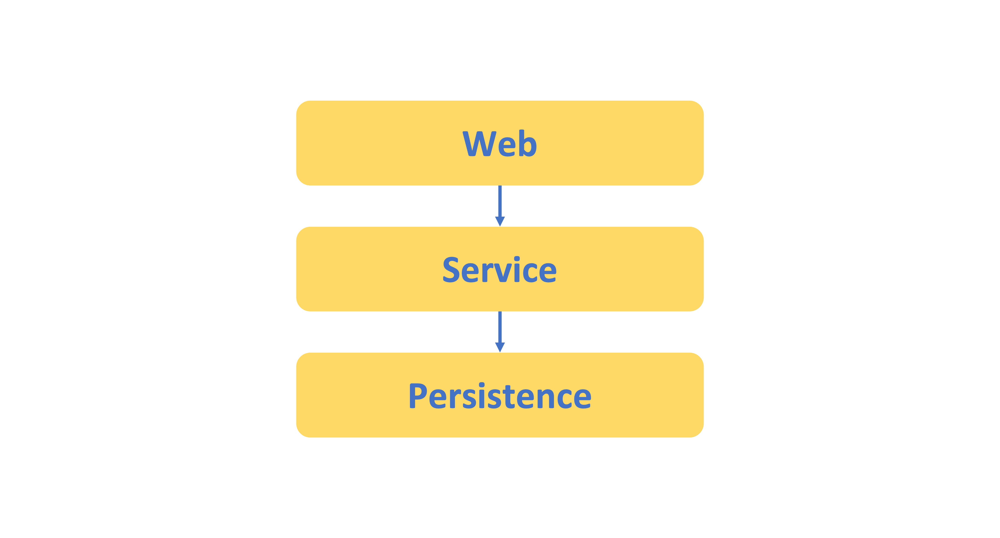

# 계층형 아키텍쳐의 문제점

## 목차
- [Intro](#intro)
- [계층형 아키텍쳐의 문제점](#계층형-아키텍쳐의-문제점)
  - [데이터베이스 주도 설계와 의존성](#데이터베이스-주도-설계와-의존성)
  - [Usecase를 숨긴다](#usecase를-숨긴다)
- [Wrap Up.](#wrap-up)

## Intro

백엔드 기본형태를 공부 할 때에나, 웹 애플리케이션을 개발할때에나 많은 상황에서 계층형 아키텍쳐로 개발을 시작한다.

주로 아래와 같은 형태로 많이 그림을 보아왔고 개발을 시작했던 기억이 난다.

- 웹 계층에서는 사용자의 요청을 받아 도메인 혹은 서비스 계층으로 요청을 보낸다
- 도메인 계층에서는 요청을 받아서 비즈니스 로직을 처리하고, 결과를 서비스 계층으로 반환한다
- 영속성(Persistence) 계층에서는 도메인 계층에서 받은 요청을 DB에 저장하거나, DB에서 데이터를 가져와서 도메인 계층으로 반환한다

사실, 계층형 아키텍쳐는 지금까지 기본적인 웹의 이해를 위해 꼭 필요한 과정들이라고 생각된다.
그만큼 견고한 아키텍쳐이기 때문에 잘 이해하고 구성한다면 많은 도움이 될 것이다.

다만 내가 보아왔던 계층형 아키텍쳐는, 서비스가 커지면 커질수록 소프트웨어를 변경하기 점점 어렵게 만들었었다.

## 계층형 아키텍쳐의 문제점

- 데이터베이스 주도 설계를 유도한다
- 계층간의 의존성이 높아진다
- Usecase를 숨긴다

### 데이터베이스 주도 설계와 의존성

계층형 아키텍쳐를 잘 따라 내려가보면 `데이터베이스 주도 설계` 가 된다.

웹 계층은 도메인/서비스 계층에 의지하게되고 도메인/서비스 계층은 영속성 계층에 의지하게 된다. 그렇게 자연스럽게 데이터베이스에 의존하게되는 서비스가 된다.

이 방식이 나쁘거나 틀렸다는 얘기는 절대 아니다. 하지만, 데이터베이스에 의존하는 서비스를 만들고 나면, 우리가 만들고있는것이 "실제 사용자의 행동" 과 관련이 있는 것인지
DB에 데이터를 잘 쌓게 만드는 것이 주요한 개발요점이 되는 것 같았다.

우리가 만드는 대부분의 어플리케이션의 목적은 사용자의 행동을 반영하는 것이다.
그렇다면, 데이터베이스에 의존하는 서비스를 만들고 나면, 우리가 만들고있는것이 "실제 사용자의 행동" 중심으로 모델링 하기가 어려워진다.

이렇게되면 서비스(도메인) 계층이 영속성(Persistence)계층에 강하게 의존하게되어 도메인 로직에서 영속성과 관련있는 아래와 같은 작업들을 꽤 해주어야한다.

- 지연로딩 (lazy loading)
- 즉시 로딩 (eager loading)
- 데이터베이스 트랜잭션
- 캐시 플러시
- ...etc

### Usecase를 숨긴다

개발을 하다보면 늘, 새로운 서비스 유즈케이스들을 만드는것을 선호한다. 많은 개발자들이 동의하겠지만 새로 시작하는 코드가 짜릿하고 재밌다.

레거시 프로젝트 뿐 아니라, 초창기 서비스도 마찬가지로 겪는 문제이다.

"숨긴다" 라고 표현했지만, 실제로 숨긴다는것이 아니라, 계층형 아키텍쳐에서 로직들이 여러곳으로 분산 될 가능성이 있기 때문에 찾지 못하는것이다.

예를들어, 위의 `데이터베이스 주도 설계와 의존성` 때문에 입맛에 맞게 코드들을 레이어 상관없이 흩뿌리게 된다.

이런 케이스들이 많아져서 실제 도메인 로직들을 찾기가 점점 어려워지는 것 이다.

## Wrap Up.

이외에도 수많은, 경험에서 나온 불편함들이 많을것이다. 앞으로 이런 불편함을 해결하기위해서 클린아키텍쳐의 관점으로 프로젝트를 수정/개발 해보려고한다.
