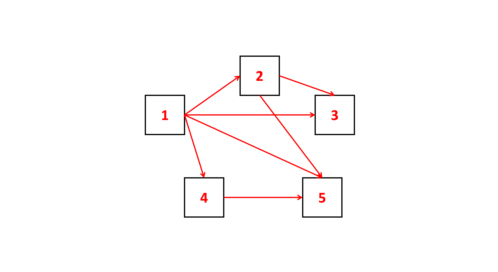
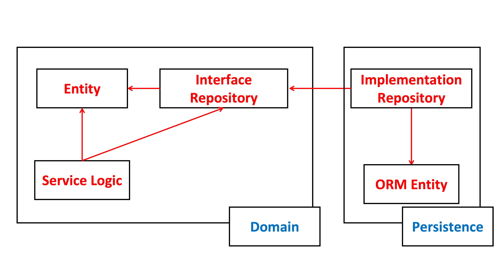

# 의존성을 역전하자

## 목차
- [SRP?](#srp)
- [DIP?](#dip)
  - [어떻게 의존성을 역전시키지?](#어떻게-의존성을-역전시키지)
- [Wrap Up](#wrap-up)

의존성 역전을 알아보기 전 SRP와 DIP에 대해서 간단히 정리하자.

SRP와 DIP는, SOLID원칙에서 각각 "S"와 "D"를 담당하고있다.

## SRP?

SRP란, Single Responsibility Principle의 약자로 단일 책임 원칙이다.

하나의 객체는 반드시 하나의 동작에 대한 책임을 갖는다. `객체를 변경하는 이유는 오직 하나 뿐 이어야 한다.` 라고 얘기 할 수 있다.

모듈화가 강해질수록, 다른 객체와의 의존/연관성이 줄어든다. 반대로 이야기하면 모듈화가 약해질수록 다른 객체와의 의존/연관성은 크게 늘어나며, 최악의 경우에는 어디에서든 모든 모듈의 메서드에 접근 할 수 있게된다.

아키텍처 관점에서는 이 객체를 변경하더라도 `다른 객체에 대해서` 신경 쓸 필요가 없다.

하지만 이것은, `객체간의 의존성` 때문에 늘 쉽게 무너지는 부분 중 하나이다.



위의 그림은 사각형을 컴포넌트(객체)라고하고 화살표를 의존성이라고 가정한 그림이다.

1번 컴포넌트는 2,3,4,5 컴포넌트에 의존하고있으며 2번은 3,5 컴포넌트, 4번은 5번 컴포넌트에 의존하고있다.

이 중, 3번과 5번 컴포넌트만 다른곳으로 화살표가 나가지 않는 것을 볼 수 있다. 3번과 5번 컴포넌트는 원하는 때에 다른 컴포넌트를 크게 신경쓰지 않고 개발 할 수 있다.

내가 좋아하는 동료 중 한분이, 의존성을 잘 파악해보는 방법을 넌지시 알려주었는데 인상깊었다.

`의존성을 가장 쉽게 파악하는 방법은, import문을 보면 된다!`

이미 알고있는 내용일 수 있지만, 의존성을 파악하는데 있어서 가장 쉬운 방법이라고 생각한다.

```java
// ComponentA.java

import ComponentB;
import ComponentC;

public class ComponentA {

    private ComponentB componentB;
    private ComponentC componentC;

    public ComponentA() {
        this.componentB = new ComponentB();
        this.componentC = new ComponentC();
    }

    public void doSomething() {
        componentB.doSomething();
        componentC.doSomething();
    }
}
```

## DIP?

DIP는, Dependency Inversion Principle의 약자로 의존성 역전 원칙이다.

레이어 아키텍처에서 계층 간 의존성은 아래와 같이 항상 다음 계층인 방향을 가르킨다.


상위 계층들이 항상 하위계층보다 바꿀 것이 더 많다는 것을 알 수 있다.

레이어 아키텍처에서, 영속성 계층의 변경은 비즈니스 계층의 모든 로직에 대해 영향을 미친다. 이는 영속성 계층의 변경이 비즈니스 계층과 그 이후의 모든 계층의 로직을 변경하게 만든다는 것이다.

DIP는 애플리케이션의 가장 핵심인 `도메인 로직`을 지켜내고, 영속성 계층이 바뀐다고해서 핵심 로직들이 쉽게 바뀌지 않게 도와주는 역할을 한다.

### 어떻게 의존성을 역전시키지?

- 도메인(서비스) 코드와 영속성 코드 간의 의존성을 역전시켜서, 영속성 코드가 도메인 코드에 의존하게 한다
- 엔티티는 도메인 객체를 표현하고 도메인 코드는 이 엔티티들의 상태를 변경하는 일을 중심으로 하기 때문에 먼저 엔티티를 도메인 게층으로 올린다
- 도메인 계층에 레포지토리에 대한 인터페이스를 만들고, 실제 리포지토리는 영속성 계층에서 구현하게 한다.



## Wrap Up

- SRP와 DIP를 정리했으니, 앞으로 공부할 클린아키텍쳐에 대한 내용들을 위한 약간의 준비를 했다
- 클린아키텍쳐에 대한 내용들은 다음 포스팅에서 정리할 예정이다
